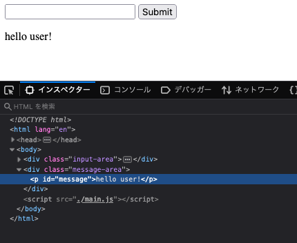
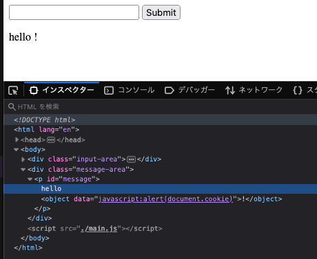
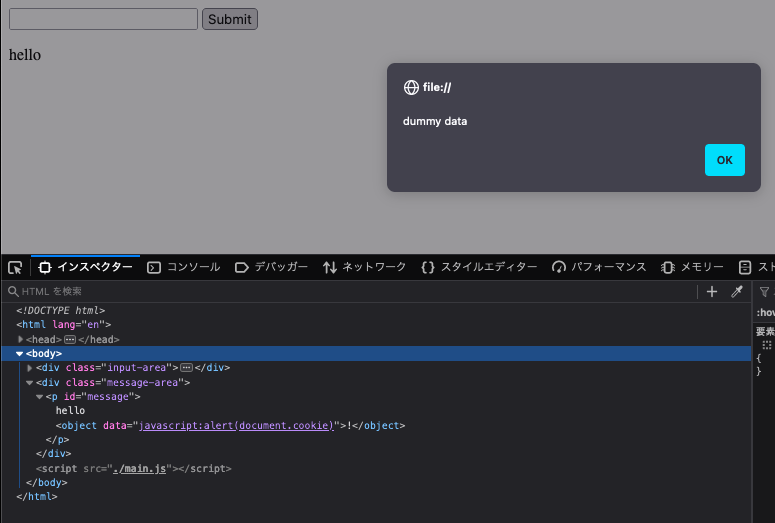
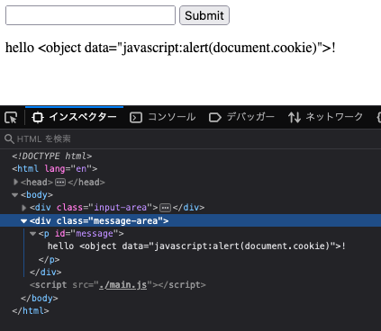

入力をバリデーション・サニタイズしなかった場合、どのようにXSSを実行できるか試したときのメモ。  
HTMLインジェクションからのXSSをお試し。

ブラウザはfirefoxを使用。

## やったこと概要
安全でないsinkを使ってユーザーの入力値をページに反映する。  

入力をページに反映させるfunctionをsinkと呼ぶ。  
入力をページに反映させる場合は、安全なsink(=危ないデータをサニタイズしてくれる・文字列として扱ってくれるsink)を使用するべき。  
安全なsinkは以下。  
https://cheatsheetseries.owasp.org/cheatsheets/Cross_Site_Scripting_Prevention_Cheat_Sheet.html#safe-sinks  

安全・安全じゃないものの例  
textContentは安全(値を文字列として扱ってくれる)だが、innerHTMLは安全ではない。  
(innerHTMLは\<script\>タグのスクリプトを実行しない。しかし、\<object\>タグなどのスクリプトは実行されてしまうので、安全ではない。)

## XSSできちゃうコード例（innerHTMLを使った場合）
innerHTMLをつかってページへ入力値を反映し、スクリプトを埋め込む。

index.html
```HTML
    <div class="input-area">
        <input id="input" value>
        <button onclick="onSubmitButtonClick()">Submit</button>
    </div>
    <div class="message-area">
        <p id="message">Enter your name</p>
    </div>
    <script src="./main.js"></script>
```

main.js
```JS
const setMessage = (message) => {
    // 表示するメッセージを設定
    // 悪意のある入力に含まれるスクリプト実行を再現するため、入力制限・サニタイズせず、innerHTMLへ入力値を設定してしまった体で
    const p = document.getElementById("message");
    p.innerHTML = "hello " + message + "!";
}

const onSubmitButtonClick = () => {
    const input = document.getElementById("input");

    // 入力内容を保存し、メッセージとエリアに入力内容を表示する
    localStorage.setItem("input", input.value);
    setMessage(input.value);
    input.value = "";

    alert("submitted \n" + localStorage.getItem("input"));
}

(() => {
    // XSS成功したときに読み出すcookieを設定
    document.cookie = "dummy data";

    // 保存された入力を読み出す
    const value = localStorage.getItem("input");
    setMessage(value);
})();
```

## 値を入力したときの様子

### 正常な値を入力した場合  
入力値は以下
> user



### スクリプトを含むDOMを値として入力した場合  
DOMが挿入されてしまう。  
これに伴ってDOMに含まれるスクリプトも実行できる状態になる。  

入力値は以下
> \<object data="javascript:alert(document.cookie)">



悪意のあるスクリプトが実行されたときの画面


## textContentだったらどうなるか
値が文字列として扱われるので、値に含まれるスクリプトが実行されない。  

```JS
const setMessage = (message) => {
    const p = document.getElementById("message");
    // textContentへ修正
    p.textContent = "hello " + message + "!";
}
```

### スクリプトを含むDOMを値として入力した場合  
入力値は以下
> \<object data="javascript:alert(document.cookie)">


